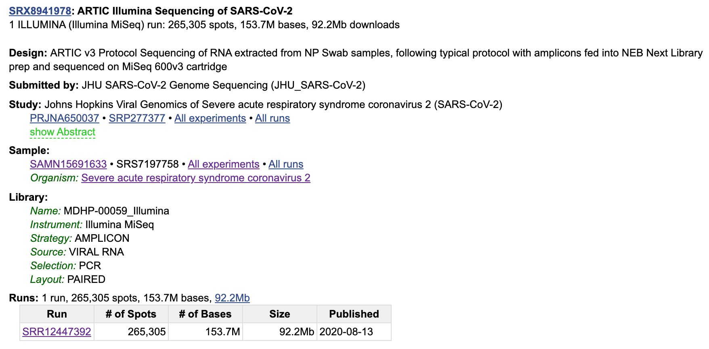
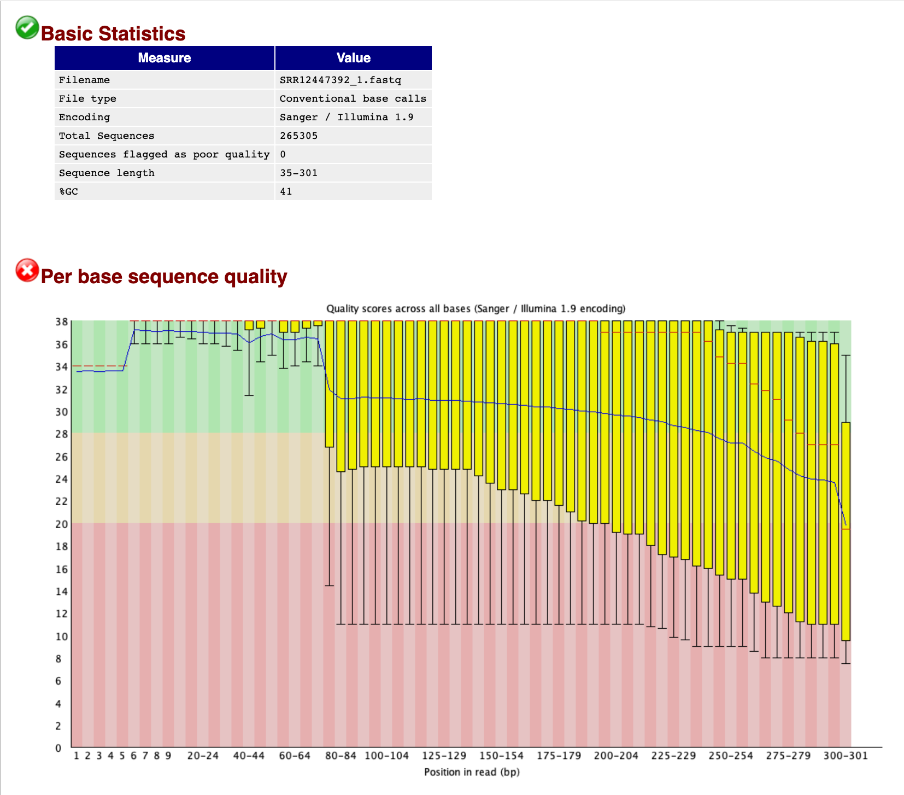

# Module #1: Sequencing and QC

***
Lead: Sara Javornik Cregeen  
TA: Anil Surathu  
Baylor College of Medicine
***

## Goals of this module
This hands-on tutorial will teach you how to explore Illumina raw sequence data and perform quality filtering and adapter trimming. We will also cover contaminate sequences removal (e.g. host DNA) and explore one way of removing amplicon sequencing primers from the raw reads. The outputs of this tutorial will be used in the next modules.      

## Learning Objectives
* Learn how to review your raw fastqs files and asses quality.    
* Perform quality filtering and adapter trimming using `bbduk`.  
* Remove human reads from trimmed fastqs using `bbmap`.  
* Remove ARTIC amplicon primers from processed reads using `iVar`.    

***

## Background On QC

It is always a good idea to perform some data exploration on your raw sequence reads to assess their quality and the presence of non-biological sequences in your reads (e.g. adapters, primers). Depending on your sequencing method you might also need to remove any non-target reads, such as host DNA or spike-ins. A final optional step is to perform an initial screening to get an overview of what is present in your sample. We covered most of the theory of these steps in the lecture, now let's see how they are implemented in practice.    

***
*Connect to your DNAnexus instance and open up a shell prompt.*

# Prepare for running the analysis
The following steps are assuming that you already did `dx ssh_config` in the intro session.  

### Steps
1- `dx select --level=VIEW` to choose the current project using `0`   
2- `dx run --instance-type mem2_ssd1_v2_x32 app-cloud_workstation --ssh`   
3- Select `0` and give it `1d`  
4- Select `2` copy and paste this directory to prompt `source/module1-2_tools`  
5- Press 'Enter' & 'Y' to start the DNANexus instance. 
6- Copy and run `source .bashrc` to activate base conda environment. In some case this command may need to be run multiple times. Successful execution of this command will add text _(base)_ to the command prompt as show here: **(base) dnanexus@job-G1QPYX00VJZk171KG87Zjbz7:~**
7- Use these commands to set environment.  
```
unset DX_WORKSPACE_ID
dx cd $DX_PROJECT_CONTEXT_ID:
```

8- Download the module if you did not already  
```
dx download -r Module1
dx download -r source
```

9- Run the following `conda activate SVanalysis`. This activates the conda environment that contains tools used in Modules 1 and 2. Note the change in command prompt to **(SVanalysis) dnanexus@job-G1QPYX00VJZk171KG87Zjbz7:~**   
10- Test. If the prompt returns a path to the tool, you have success.    
```
which fastqc
which bbmap.sh 
which ivar
```
10- Navigate to the Module1 directory: `cd Module1`  
11- When you run `ls -l`, you should see two directories:
```
# The directory containing the raw fastq files and database files
raw_data
raw_data/databases
# Pre-generated files that we will be creating in this tutorial
module1_outputs
```

***
## Downloading the example sample

We will be working with an example main read dataset throughout the workshop. It can be found under NCBI ID [SRR12447392](https://www.ncbi.nlm.nih.gov/sra/SRX8941978%5Baccn%5D).  
<br>  

  

The data has been pre-downloaded for you and can be found in `raw_data`. We used the `sra-tools` to download the sample from the command-line. If you would like more information about how to use this set of tools go to the [sra-tools](https://github.com/ncbi/sra-tools/wiki) wiki.  
<br>  

```
prefetch -v SRR12447392
# chose where you want to download the files to (note: if you choose raw_data you will overwrite the existing files there)
fastq-dump --outdir <path-to-output> --split-files /home/dnanexus/ncbi/public/sra/SRR12447392.sra 
```
> Why don't you try downloading this SRR or a different one (e.g. SRR14023759) using the commands above?  
<br>  

## Quality Trimming Your Sequence Data

First of all make sure we are all in the same location. If you haven't already navigate to `Module1` directory and create `processed_data` and `logs`.    

```
mkdir processed_reads logs
ls -l
```
<br>  

We have our read dataset, let's do an initial exploration of the fastq files.   

```
# Inspect one of the sequence files
cat raw_data/SRR12447392_1.fastq | head -8
```
> What do you see in the output of the command? Is it different from what you expected and if so how?  
<br>  

### FastQC - visualization of the sequence quality

There are many ways of assessing sequence quality and a variety of tools available. We will be using [FastQC](https://www.bioinformatics.babraham.ac.uk/projects/fastqc/) in this workshop, because it offers a fast and simple way to visualize a single sample.  

```
# get options
fastqc --help | less

mkdir fastqc_report
fastqc raw_data/SRR12447392_1.fastq raw_data/SRR12447392_2.fastq -o fastqc_report -q

ls -l fastqc_report/
```

> Explore the statistics reported in the fastqc outputs. What do you think?     
<br>  

When the command has finished executing you should see 4 files in the output directory. There is an `html` file per pair and a `zip` file that contains the tables used in creating the plots in the html report. If you open one of the html files and you should see a report like the one shown below.  
<br>  

  

### BBduk - quality and adapter trimming  

We'll be using the [BBMap](https://sourceforge.net/projects/bbmap/) suite of tools for the next few steps. This is a collection of tools used for different types of sequence processing, from trimming to mapping and assembly.  
<br>  

1. Read length distribution (another way of looking at it)  
```
# Get a histogram of read lengths
readlength.sh in=raw_data/SRR12447392_1.fastq in2=raw_data/SRR12447392_2.fastq out=SRR12447392.length-preTrimmed.txt
cat SRR12447392.length-preTrimmed.txt
```
*Note: We are processing the reads here as paired, but you could generate a histogram for each pair separately.*     

> Are the majority of the reads in your expected range?  
Why is the number of reads bigger than what is reported in the fastqc report?  
<br>  

2. Quality and adapter trimming  

```
# get options
bbduk.sh | less 

# command
bbduk.sh in1=raw_data/SRR12447392_1.fastq in2=raw_data/SRR12447392_2.fastq out1=processed_reads/trimmed_SRR12447392_1.fastq out2=processed_reads/trimmed_SRR12447392_2.fastq qtrim=rl trimq=15 minlength=100 qout=33 ref=raw_data/databases/adaptersPhiX.fa stats=logs/SRR12447392.bbduk.stats.log 2>logs/SRR12447392.bbduk.log
```
*Note: The reference file that we are using here is one that combines Illumina adapter files and the PhiX reference genome. The BBMap package comes with a variety files in `bbmap/resources/` files and the `adaptersPhiX.fa` file was created by merging the relevant individual provided files.*  

> Have a look at the two log files in `logs`. What are they reporting?  
If you run the `readlength.sh` command on the trimmed files, how is it different?  
<br>  

### BBMap - host removal  

Most data sets that are uploaded to NCBI will likely have the host reads removed, in particular when it is human patient samples. However, this will not be the case for data you get directly from a sequencer. The amount of contaminant or host DNA will depend on the sequencing method. For example, targeted amplification or capture sequencing approaches are designed to minimize non-specific read sequencing. But some sample types (e.g. low biomass samples) are prone to more unspecific reads noise, so it is useful to be able to remove those reads prior to downstream processing.  
<br>  

```
# host removal step - this will take the longest to execute (few minutes)
bbmap.sh -Xmx24g in=processed_reads/trimmed_SRR12447392_1.fastq in2=processed_reads/trimmed_SRR12447392_2.fastq path=raw_data/databases/humanGenomeBBMap nodisk k=15 outm=logs/SRR12447392.hostMapped.sam outu=processed_reads/humanRemoved_SRR12447392.fastq minid=.90 usemodulo=t fast=t noheader=t notags=t 2>logs/SRR12447392.host.align.bbmap.log

# separate the interleaved file into read1 and read2 files
reformat.sh in=processed_reads/humanRemoved_SRR12447392.fastq out1=processed_reads/humanRemoved_SRR12447392_1.fastq out2=processed_reads/humanRemoved_SRR12447392_2.fastq
```
*Note: We are using the [GRCh38.patch13](https://www.ncbi.nlm.nih.gov/assembly/GCF_000001405.39) human reference genome. For the purposes of this workshop, we have provided you with a pre-indexed database ready to use with BBMap. If you would like to use a different reference it will need to be indexed during the first use and that can take some time. To learn more about option and explore the parameters try running `bbmap.sh | less` or going to the BBMap website.*  
<br>  

Because the log file generated by the bbmap step isn't the most informative in terms of how many reads were remove, you could run the folowing command to get a feel for how the read counts have changed.  

```
cat processed_reads/humanRemoved_SRR12447392.fastq | paste - - - - | wc -l
cat logs/SRR12447392.bbduk.log | grep "Result:" 
```

> Compare your sequence read count to the counts in the previous log files. Were there many human reads in the sample? 
What number do you get if you count the lines in logs/SRR12447392.hostMapped.sam? Does it match what you calculated in the step above?  
<br>  

### iVar - removing ARTIC primers

The final step in Module1 is removing the amplification primers from our reads. This will be done by using the primer positions given in the [Artic primer BED](https://raw.githubusercontent.com/artic-network/primer-schemes/master/nCoV-2019/V3/nCoV-2019.primer.bed) file to soft clip the primer sequences in a SARS-CoV2 reference aligned and sorted BAM file. We will be using `bwa`, `samtools` and [iVar](https://andersen-lab.github.io/ivar/html/index.html) to do this. A more detailed explanation about alignment, reference mapping and the SAM/BAM format will be given in Module2.  
<br>  

```
bwa mem -t 2 raw_data/databases/covid-19.NC_045512.polyA.Masked.fa processed_reads/humanRemoved_SRR12447392_1.fastq processed_reads/humanRemoved_SRR12447392_2.fastq > processed_reads/SRR12447392_mapped.sam

# Input file - test.bam
samtools sort -o processed_reads/SRR12447392_sorted.bam processed_reads/SRR12447392_mapped.sam
samtools index processed_reads/SRR12447392_sorted.bam

ivar trim -b raw_data/databases/nCoV-2019.primer.bed -p processed_reads/SRR12447392_trimmed -i processed_reads/SRR12447392_sorted.bam 1>logs/SRR12447392.ivar.log
```

***

Next: [module2!](module2.rst)
