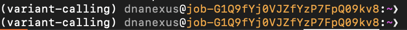
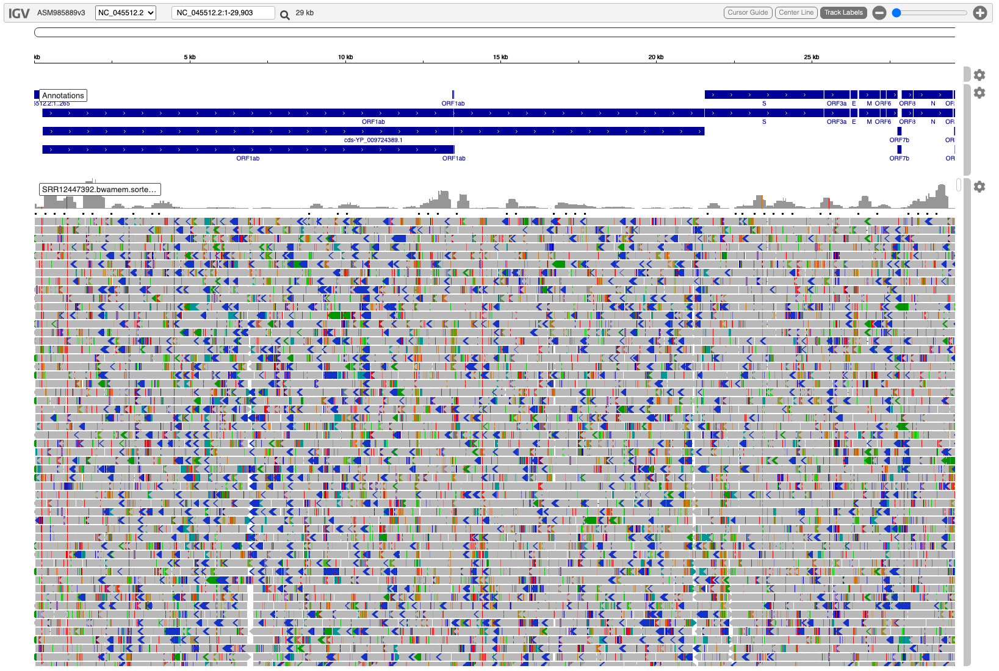
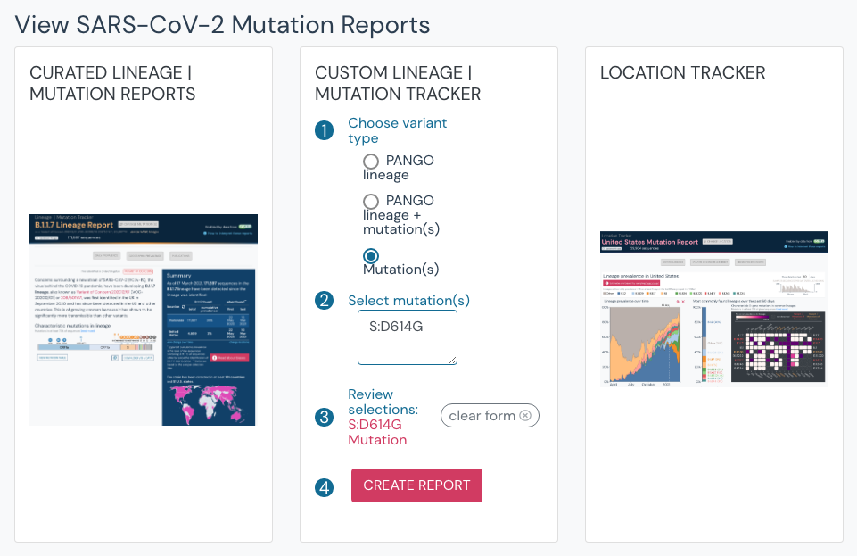
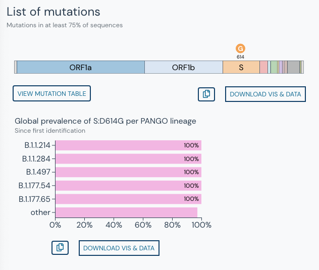
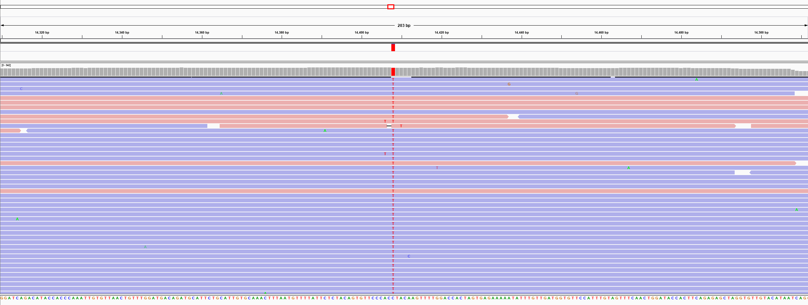

#  Module #3: Reference-guided assembly and low frequency variant calling

***
Leads: Yunxi Liu, Nicolae Sapoval, and Todd Treangen 
Rice University
***

## Goals of this module
* This hands on tutorial will teach you how to call single nucletide variants (SNVs) and indels from the aligned viral sequencing reads (SAM/BAM files), and how to subsequently create a reference-guided assembly of the SARS-CoV-2 genome.

## Learning Objectives
* Be able to pre-process BAM files to prepare them for variant calling
* Use variant calling software LoFreq to call SNVs and indels
* Use variant calling software iVar to call SNVs and indels
* Be able to compare and merge the calls produced by the two tools
* Assemble a SARS-CoV-2 genome using a reference genome and variant calling output file (VCF)

***

## Background On reference-guided assembly and low frequency variant calling

The slides covering the background information are available at [this link](https://rice-my.sharepoint.com/:p:/g/personal/ns58_rice_edu/EVzwEJTAUPFCj_taLBcIYYABV05DlROOYu1IoixxudDi2g?e=OzcNci).

## Low frequency variant calling

### Workspace configuration

Spin up a DNAnexus cloud instance as follows:
1. `dx run app-cloud_workstation --ssh`
2. When prompted select option `2`
3. Specify path to the snapshot, in this case it's `Module-3/variant-calling.snapshot`
4. Let the instance boot up
5. Once inside the instance terminal run `unset DX_WORKSPACE_ID` followed by `dx cd $DX_PROJECT_CONTEXT_ID:`
6. Then run `source .bashrc`, when executed succesfully you will see `(base)` added in front of the terminal prompt
7. Now, we can activate the conda environment we will use for this session by running `conda activate variant-calling`

The last step completes the configuration we need for this session, your prompt in the terminal should look similar to the one below.


### Variant calling: LoFreq 

If you want to call both indels and SNPs then you will first have to assign indel quality scores in your BAM. LoFreq makes this easy to do for Illumina data, for other use cases you might have to consider an external tool to assign the indel quality scores before calling indels. For this workshop we have already performed this step for you and placed the output in `Data/SRR12447392.bwamem.sorted.indelqual.bam`.

1. (Optional) Since our dataset consists of paired-end Illumina reads we can use the built-in implementation of Dindel ([PMID 20980555](https://pubmed.ncbi.nlm.nih.gov/20980555/)) inside the LoFreq to assign the indel qualities as follows.
```
lofreq indelqual --dindel -f Data/SARS-CoV-2-reference.fasta -o Output/SRR12447392.bwamem.sorted.indelqual.bam Data/SRR12447392.bwamem.sorted.bam
```

2. Now, we can call the variants using the following LoFreq command.
```
lofreq call -f Data/SARS-CoV-2-reference.fasta --call-indels -o Output/SRR12447392.lofreq.indel.vcf Data/SRR12447392.bwamem.sorted.indelqual.bam
```

An example of BAM file with indel qualities for the SRR12447392 sample of SARS-CoV-2 visualized using IGV browser.


**CHECKPOINT:** We have provided a BAM file with indel scores added to it in the snapshot, the file is located at `Data/SRR12447392.bwamem.sorted.indelqual.bam`. You should be able to run the second command and then compare your output VCF with the provided reference run at `Output-reference/SRR12447392.lofreq.indel.vcf`. The quickest way to verify that your run was succesful is to call
```
diff Output/SRR12447392.lofreq.indel.vcf Output-reference/SRR12447392.lofreq.indel.vcf
```
you should see that nothing is reported since the two outputs will be identical.

### Variant calling: iVar

Now, we will call variants using iVar variant caller. To do so run
```
samtools mpileup -aa -A -d 500000 -B -Q 0 Data/SRR12447392.bwamem.sorted.bam | ivar variants -p Output/your_output_name_prefix -q 20 -t 0 -r Data/SARS-CoV-2-reference.fasta -g Data/SARS-CoV-2-reference.gff3
```
**Note:** We explicitly ask iVar to not filter out any variants by setting allele frequency threshold to 0 with the `-t` flag, as the result of this you will see that your output is extremely noisy. 

**CHECKPOINT:** Similarly to the LoFreq case we can validate that everything ran as expected by checking the `diff` between our output and the reference output
```
diff myOutput.tsv Output-reference/SRR12447392-ivar.tsv
```

### Comparing variant calls

Finally, after obtaining two sets of variant calls we can merge them to see what mutations are picked up by both tools. Since, we haven't applied any allele frequncy filters in the previous steps our calls are very noisy now. We can apply the allele frequency filter at this final merging stage. 

To merge variants we will use a simple Python script `MergeCalls.py` provided both in this repository and in your instance snapshots.
```
python MergeCalls.py --min-af 0.02 -p -o Output/merged-calls-af-0.02-pass-only.tsv Output/SRR12447392-ivar.tsv Output/SRR12447392.lofreq.vcf 
```
The `--min-af` flag will determine minimum allele freqeuncy that should be reported by at least one of the two variant callers for the given variant. The `-p` flag determines whether we only want to retain variants for which iVar statistical test indicated p-value <= 0.05, if this flag is not provided the `PASS` value of the iVar output is ignored. 

**CHECKPOINT:** You can use `diff` again to compare your results of running the above command with our pre-computed reference
```
diff Output/merged-calls-af-0.02-pass-only.tsv Output-reference/merged-calls-af-0.02-pass-only.tsv
```

### Bonus: checking your variants for lineage inference

iVar indicates the amino acid change and the corresponding protein/gene of SARS-CoV-2. We can use this information that is available in our combined output to check if some of the variants are indicative of a lineage of concern by using [outbreak.info](https://outbreak.info/). 

For example in the combined output file `Output-reference/merged-calls-af-0.02-pass-only.tsv` we note the following iSNVs of interest that occur in S gene (cds-YP_009724390.1)
```
22176C>A	0.0173611	cds-YP_009724390.1	TCT	S	TAT	Y
23273G>T	0.0241642	cds-YP_009724390.1	GAC	D	TAC	Y
23318G>T	0.017037	cds-YP_009724390.1	GAC	D	TAC	Y
23403A>G	0.996657	cds-YP_009724390.1	GAT	D	GGT	G => S:D614G variant
23879G>T	0.0176132	cds-YP_009724390.1	GAA	E	TAA	* 
24176C>A	0.0108717	cds-YP_009724390.1	CAA	Q	AAA	K
24365C>A	0.0144222	cds-YP_009724390.1	CAA	Q	AAA	K
24515G>T	0.0147268	cds-YP_009724390.1	GAC	D	TAC	Y
```

Once we know the location and the amino acid change we access outbreak.info website and input the mutations to create a report.


Since S:D714G is a common mutation for multiple lineages we will not get a specific result with just one mutation.


## Reference-guided assembly

The first step to starting your assembly --> context to DNAnexus

*Connect to your DNAnexus instance and open up a shell prompt.*

The tools we need to perform a reference guided assembly are bcftools and lofreq. First we still want to make sure that we have `conda-forge` and `bioconda` channels set up in our conda.
```
conda config --add channels conda-forge
conda config --add channels bioconda
```
Next, activate the working environment using 
```
conda activate workshop-env
```
Install tools using 
```
conda install bcftools
```
If you have already install lofreq in the variant calling step, you can skip the following command
```
conda install lofreq
```
Bcftools contains a collection of tools for variant calling and manipulating VCFs and BCFs, the specific command we are interested in is `bcftools consensus`, which will create consensus sequence by applying VCF variants to a reference fasta file. By default, the program will apply all alternative variants no matter what the allele frequencies are. To generate a valid reference-guided assembly, first we want to filter the variants by their allele frequencies (and some other characteristics if additional quality control is required). 

### Filtering Variants by the allele frequencies

In the previous step, we have generated the vcf file for the targeted alignment file (BAM file). Such vcf file will contain all variants with allele frequencies ranging from 0 to 1. By default lofreq would perform some default filtering to make sure the variant calls are accurate. For reference-guided assembly, we are going to mainly focus on variants with allele frequencies >= 0.5, which indicates that more than half of reads supports the allele base at certain location. We use the following command with option `-a` or `--af-min` to filter vcf files by the allele frequencies of the variants
```
lofreq filter -a 0.5 -i your_input.vcf -o your_output.filtered.af50.vcf
```
**Note:** Lofreq will run a set of default filters in `lofreq call`, this step can be manually turn off using the option `--no-default-filter`.

**Note:** By default, `lofreq call` does not allow output overwrite. If you have run variant calling multiple times with the same output name, use option `--force-overwrite`.

### Construction of consensus sequence
Now we can generate the consensus sequence using bcftools, currently bcftools only supports compressed gz file format, so we have to first compress the vcf file.
```
bgzip your_output.filtered.af50.vcf
```
Once the vcf is compressed, use bcftools to index it.
```
bcftools index your_output.filtered.af50.vcf.gz
```
After the vcf is indexed, call consensus based on the reference fasta.
```
bcftools consensus -f SARS-CoV-2-reference.fasta -o your_output.consensus.fasta your_output.filtered.af50.vcf.gz
```

### Parameter tuning of reference-guided assembly
There are a lot of parameters involved in the reference-guided assembly pipeline. Here we mainly focus on the parameters during the consensus calling process. In this section, we will try generate consensus sequences of the same dataset using different minimum allele frequency cutoff during the vcf filtering, and we will try generate consensus sequences of the same dataset with and without using iupac-codes. 

1. Generate consensus with minimum allele frequency of 0.02
First, filtered the orginal vcf file with the following command:
```
lofreq filter -a 0.02 -i your_input.vcf -o your_output.filtered.af02.vcf
```
Then follows the steps in the consensus construction section, remember to output the consensus with a different file name.

2. Generate consensus with minimum allele frequency of 0.99
First, filtered the orginal vcf file with the following command:
```
lofreq filter -a 0.99 -i your_input.vcf -o your_output.filtered.af99.vcf
```
Then follows the steps in the consensus construction section, remember to output the consensus with a different file name.

**CHECKPOINT:** Use command `nl your_output.filtered.af02.vcf`, `nl your_output.filtered.af50.vcf`, and `nl your_output.filtered.af99.vcf` to view the filtered vcf files. Have you notice any difference?

3. Generate consensus with minimum allele frequncy of 0.5 with iupac-codes enabled, then compare it to the consensus we previously generated with the same parameters except iupac-codes.
First, filtered the orginal vcf file with the following command:
```
lofreq filter -a 0.5 -i your_input.vcf -o your_output.filtered.af50.vcf
```
Then use the following command to compress and index the vcf file:
```
bgzip your_output.filtered.af50.vcf
bcftools index your_output.filtered.af50.vcf.gz
```
To generate a consensus sequence with iupac-codes enabled, use `-I` option:
```
bcftools consensus -f SARS-CoV-2-reference.fasta -o your_output.iupac.consensus.fasta -I your_output.filtered.af50.vcf.gz
```

**CHECKPOINT:** Use command `diff your_output.iupac.consensus.fasta your_output.consensus.fasta` to compare difference between two consensus sequence. Have you notice any difference?


An example of the alignments of reads and a variant with high frequency for a SARS-CoV-2 sample (SRR12447392) zoomed in at position 14310-14511.


Next: [module4!](module4.rst)
